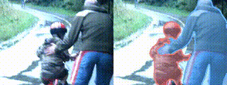
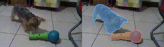

<div align="center">
<h1>InterRVOS: Interaction-Aware Referring Video Object Segmentation</h1>

[**Woojeong Jin**](https://github.com/wooj0216)&emsp;
[**Seongchan Kim**](https://github.com/deep-overflow)&emsp;
[**Jaeho Lee**](https://github.com/jefflee0810)&emsp;
[**Seungryong Kim**](https://cvlab.kaist.ac.kr/members/faculty)&dagger;
<br>
KAIST AI
<br>
&dagger;: Corresponding Author

**ArXiv 2025**

<a href="https://arxiv.org/abs/2506.02356">
  
</a>
<a href="https://cvlab-kaist.github.io/InterRVOS/">
  
</a>
<a href="">
  
</a>

</div>

## 📢 News

- [ ] Upcoming : Data annotation pipeline
- [ ] Upcoming: InterRVOS-127K dataset and ReVIOSa checkpoints
- [x] Released: Training code, inference & evaluation code
- [x] Released: InterRVOS on [ArXiv](https://arxiv.org/abs/2506.02356) and [Project Page](https://cvlab-kaist.github.io/InterRVOS/)


## 🎯 Release Progress

- [ ] Data annotation pipeline code
- [ ] Model checkpoints
- [ ] Modified open-source RVOS datasets (MeViS, Ref-Youtube-VOS and Ref-DAVIS)
- [ ] InterRVOS-127K dataset (Training & Evaluation)
- [x] Inference & evaluation code
- [x] Training code


## Overview

This repository contains the code for the paper **InterRVOS: Interaction-aware Referring Video Object Segmentation**.

<p align="center">
  <br>
  <em> "Adult in dark jacket guiding child in helmet" </em>
</p>

<p align="center">
  <br>
  <em> "Furry dog pushing colorful toy with green handle" </em>
</p>

In this paper, we introduce **Interaction-aware Referring Video Object Segmentation (InterRVOS)**, a novel task that focuses on the modeling of interactions. 
It requires the model to segment the <b>actor</b> and <b>target</b> objects separately, reflecting their asymmetric roles in an interaction. Please refer to the [project page](https://cvlab-kaist.github.io/InterRVOS/) for detailed visualization results.

## Model Training & Inference

Instructions for training, inference, and evaluation are provided in [ReVIOSa/README.md](ReVIOSa/README.md).

## Data Annotation

We are currently working on releasing the code for the data annotation pipeline. Stay tuned for updates!

## Acknowledgement
This project is based on [Sa2VA](https://github.com/magic-research/Sa2VA). Many thanks to the authors for their great works!

## References
If you find this repository useful, please consider referring to the following paper:
```
@misc{jin2025interrvosinteractionawarereferringvideo,
    title={InterRVOS: Interaction-aware Referring Video Object Segmentation},
    author={Woojeong Jin and Seongchan Kim and Jaeho Lee and Seungryong Kim},
    year={2025},
    eprint={2506.02356},
    archivePrefix={arXiv},
    primaryClass={cs.CV},
    url={https://arxiv.org/abs/2506.02356},
}
```